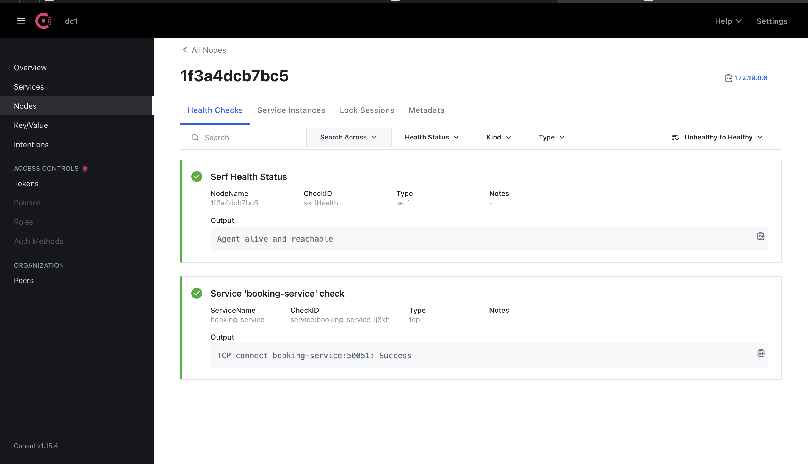

# Consul : Service Discovery

## Chapter 1: What is Consul?
responsible for: 
- Service Registration
- Service Discovery
- Health Checks
- Key-Value Store
- Multi Datacenter Support
- Service Mesh


Consul is important for microservices architecture as it provides 
- **service discovery**
- **health checks**
- **service registration**

It is a key component of a microservices architecture and is used to manage the lifecycle of microservices and to provide service discovery and load balancing.

In this project, the booking service is being registered to the consul service.

Screenshot of consul service registration:



### Prerequisite
Remember to prepare a health endpoint for the service to be registered to consul.

For example, in the booking service, we have a health controller:

```
http://{hostname}:{port}/health
```

### How to register services to Consul?

In the booking service, we have a `ConsulService` class that registers the service to consul.

referring to below link for the project's consul service registration:

[consul service registration](services/booking-service/src/consul/consul.service.ts)

#### Simpler example

```typescript
import { Injectable, OnModuleInit, OnModuleDestroy } from '@nestjs/common';
import { Consul } from 'consul';

@Injectable()
export class ConsulService implements OnModuleInit, OnModuleDestroy {
    private consul: any;
    private serviceId: string;

    constructor() {
        this.consul = new Consul({
            host: process.env.CONSUL_HOST || 'localhost',
            port: Number(process.env.CONSUL_PORT) || 8500,
        });
        this.serviceId = `${process.env.SERVICE_NAME}-${Math.random().toString(36).slice(2,7)}`;
    }

    async onModuleInit() {
        await this.consul.agent.service.register({
            id: this.serviceId,
            name: process.env.SERVICE_NAME,
            address: process.env.HOSTNAME,
            port: Number(process.env.SERVICE_PORT),
            check: {
                tcp: `${process.env.HOSTNAME}:${process.env.SERVICE_PORT}`,
                interval: '10s',
                timeout: '5s',
            },
        });
        console.log(`[Consul] Registered ${this.serviceId}`);
    }

    async onModuleDestroy() {
        await this.consul.agent.service.deregister(this.serviceId);
        console.log(`[Consul] Deregistered ${this.serviceId}`);
    }
}
```

From above example, we can see that the consul service is registered to consul when the ***module is initialized*** and deregistered when the module is destroyed.

The `OnModuleInit` and `OnModuleDestroy` are NestJS lifecycle hooks that are called when the module is initialized and destroyed, respectively.

# Chapter 2: Consul in Docker

``` Docker
consul:
    image: consul:1.15
    container_name: consul
    ports:
      - "8500:8500" # Web UI
      - "8600:8600/udp" # DNS
    command: agent -server -bootstrap -ui -client=0.0.0.0
    volumes:
      - consul-data:/consul/data
```

