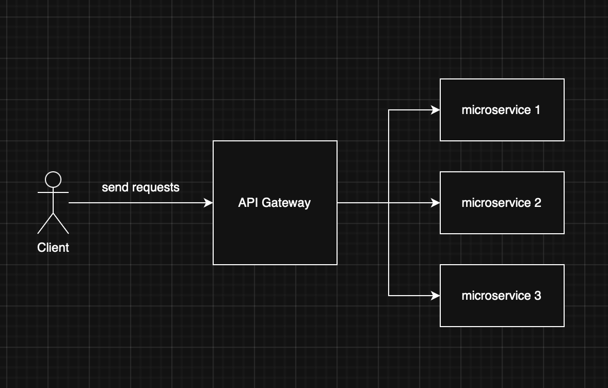

# Consul : Service Discovery

## Chapter 1: What is Consul?
responsible for: 
- Service Registration
- Service Discovery
- Health Checks
- Key-Value Store
- Multi Datacenter Support
- Service Mesh


Consul is important for microservices architecture as it provides 
- **service discovery**
- **health checks**
- **service registration**

It is a key component of a microservices architecture and is used to manage the lifecycle of microservices and to provide service discovery and load balancing.

In this project, the booking service is being registered to the consul service.

Screenshot of consul service registration:


### Prerequisite
Remember to prepare a health endpoint for the service to be registered to consul.

For example, in the booking service, we have a health controller:

```
http://{hostname}:{port}/health
```

### How to register services to Consul?

In the booking service, we have a `ConsulService` class that registers the service to consul.

referring to below link for the project's consul service registration:

[consul service registration](services/booking-service/src/consul/consul.service.ts)

#### Simpler example

```typescript
import { Injectable, OnModuleInit, OnModuleDestroy } from '@nestjs/common';
import { Consul } from 'consul';

@Injectable()
export class ConsulService implements OnModuleInit, OnModuleDestroy {
    private consul: any;
    private serviceId: string;

    constructor() {
        this.consul = new Consul({
            host: process.env.CONSUL_HOST || 'localhost',
            port: Number(process.env.CONSUL_PORT) || 8500,
        });
        this.serviceId = `${process.env.SERVICE_NAME}-${Math.random().toString(36).slice(2,7)}`;
    }

    async onModuleInit() {
        await this.consul.agent.service.register({
            id: this.serviceId,
            name: process.env.SERVICE_NAME,
            address: process.env.HOSTNAME,
            port: Number(process.env.SERVICE_PORT),
            check: {
                tcp: `${process.env.HOSTNAME}:${process.env.SERVICE_PORT}`,
                interval: '10s',
                timeout: '5s',
            },
        });
        console.log(`[Consul] Registered ${this.serviceId}`);
    }

    async onModuleDestroy() {
        await this.consul.agent.service.deregister(this.serviceId);
        console.log(`[Consul] Deregistered ${this.serviceId}`);
    }
}
```

From above example, we can see that the consul service is registered to consul when the ***module is initialized*** and deregistered when the module is destroyed.

The `OnModuleInit` and `OnModuleDestroy` are NestJS lifecycle hooks that are called when the module is initialized and destroyed, respectively.

# Chapter 2: Consul on Docker

``` Docker
consul:
    image: consul:1.15
    container_name: consul
    ports:
      - "8500:8500" # Web UI
      - "8600:8600/udp" # DNS
    command: agent -server -bootstrap -ui -client=0.0.0.0
    volumes:
      - consul-data:/consul/data
```


# Chapter 3: Deregistration in consul

While container in docker is destroyed, the consul service will not automatically deregister the service from consul. Therefore we need to manually deregister the service from consul.

Manually deregister the service from consul:

```bash
consul agent -deregister <service_id>
```
or

```curl
http://localhost:8500/v1/agent/service/deregister/<service_id>
```

Automatically deregister the service from consul when the container is destroyed:


# Chapter 4: Consul KV (Key-value)

- Main use case: storing configuration parameters and metadata
- used to store indexed objects

The Consul KV is located on the servers, therefore clients or fellow servers can access to it.

## Consul as API Gateway

### What is API Gateway?
API Gateway is act as the middleman to handle the client requests and forward it to the appropriate service.



[Cloudfare definition of API Gateway](https://www.cloudflare.com/zh-tw/learning/security/api/what-is-an-api-gateway/)

### Why use API Gateway?

Based on the documentation of Consul, it is used to serve the purposes below:

1. Control access at the point of entry: 
- Set the protocols of external connection requests
- Secure inbound connections with TLS certificates from trusted providers, such as Verisign and Let's Encrypt.

2. Simplify traffic management: 
- **Load balance** requests across services
- **Route traffic** to the appropriate service by matching one or more criteria, such as hostname, path, header presence or value, and HTTP method.


### Consul as API Gateway?

Consul official documentation states that 
``` quote
API gateways enable external network clients to securely access applications and services running in a Consul datacenter.
```

In short, Consul API Gateway can:
1. allow clients to access services in the Consul datacenter
2. can forward requests


# Chapter 5: Service Mesh

## What is Service Mesh(服務網格)?

A dedicated network layer which provides:
- secure service-to-service communication (無論是within or across infra)

### Google's Definition
Google Cloud's definition of Service Mesh:
https://cloud.google.com/service-mesh/docs/overview#what_is_a_service_mesh

在google 的文章中, service mesh是一個架構，讓服務之間是可以secure communication的， 而這些service 也能被好好的managed, observe.而這個service mesh 可以讓microservice的enterprise-grade的applications可以更好的運作。

Service mesh 通過tools 進行manage the requirements of running services, such as:
- monitoring
- networking
- security

基本上， service mesh 會有一個或多個control planes 然後單一的data plane. service mesh 會monitor 所有in-and-outbound traffic of the services.

Service Mesh 一般用於microservices architecture中，可以提供以下功能：
- secure service-to-service communication
- traffic management
- service discovery
- load balancing
- circuit breaking
- observability

### AWS's Definition

https://aws.amazon.com/what-is/service-mesh/

對於AWS 來說， service mesh 是一個composed of containerized microservices 的software layer. Service mesh 可以提供一個新興的feature來讓monitoring of microservices 變得相對有效。

Service Mesh提供的monitoring, logging, tracing, and traffic control 都是對microservices 架構的產品能提供更好的observability.


Service Mesh的兩種adoption為：
#### Service Mesh's adoption
1. Service-level observability

越多的workloads and services are deployed, 就會越難理解整個東西是怎麼運作起來的，希望整個技術團隊可以快速了解整個upstream and downstream services的dependencies的話，service mesh 或許能解決這部分的問題.

2. Service-level control

管理者需要可以control 哪個service 可以跟哪些service 互動，進行什麼樣的互動。他們會需要fine-grained control 也可以 governance over 完整的behaviour, policies and interactions of services (microservice的架構裡的services)

####  Benefits of Service Mesh

Service mesh 可以提供centralized, dedicated infrastructure layer,來處理一個distributed application 的service-to-service communication之間的瑣碎事情。

1. Service Discovery
- automated service discovery, service mesh 會自動發現service instances,可以減低operation team 的managing service endpoint的工作量
2. Load Balancing
- 多種algorithms混用來distribute requests across 幾個services instances
- 可以improve resource utilization and reduce the load on individual services, scalability

3. Traffic Management
- 提供fine-grained control over traffic routing and load balancing
- 例如
    1. traffic splitting
    你可以將流量分到不同的version of service 或者不同的configurations, mesh 會direct 部分的流量到一個 updated version, 以此達到可控又漸進的更新（gradual rollout of changes）

    2. request mirroring
    你可以將流量複製到一個test/ monitoring的service來達到analysis 的目的，無需影響到primary request flow。 這樣可以最大限度的減少對primary service/production service的影響。
    

4. Security

5. Monitoring


