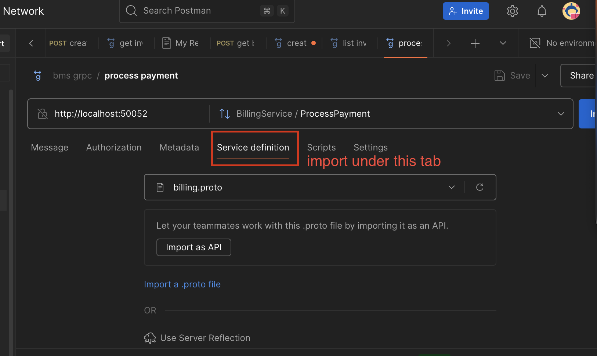
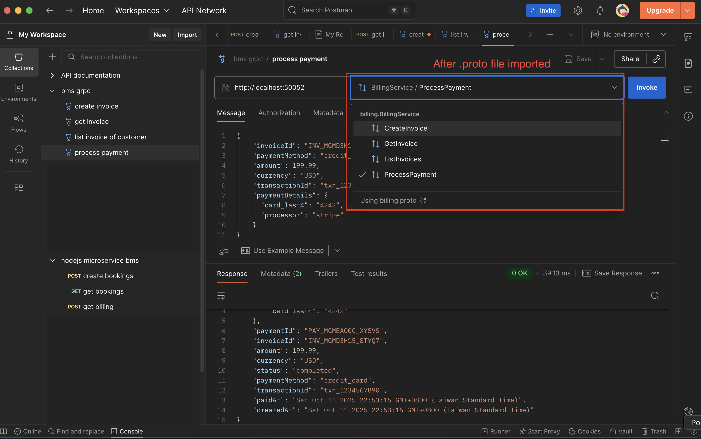

# Microservice

## Technical stacks
- NestJS
- gRPC 
- Sequelize
- PostgreSQL
- Docker

## Structure of Monorepo
This monorepo is structured as follows:
- api-gateway
- booking-service
- proto

## Architecture
**Architecture Summary:**
- **Frontend (HTTP)** communicates with the **API Gateway** using HTTP.
- **API Gateway (NestJS)** exposes REST APIs to the frontend and uses **gRPC** to talk to backend microservices.
- **Booking Service** handles all booking-related business logic and database operations.
- Future services (e.g., Device Management) can easily be added and connected via gRPC.

## API Gateway
### What is API Gateway?
- **layer of abstraction** that sits between the client and the backend services.
- acts as **single entry point** for all requests
- **routes** requests to the appropriate service based on the request path and method.
- provides additional features such as authentication, rate limiting, and load balancing.

## Proto
a gRPC Communication Contract
### What are .proto Files?
*.proto* (Protocol Buffers) files define:
- The service interfaces (what RPC methods exist)
- The request/response message types
- The data schema (like DTOs between microservices)

This will ensure 
- strict typing
    - no need to define interfaces/types
- version safety
    - forward/backward compatibility
- language independency
    - as long as the proto file is the same, the service can be implemented in any language (Java, Rust, Node.js, etc.)

The recommended place for proto
```
microservices/
├── proto/                         # Shared .proto files (single source of truth)
│   └── booking.proto
│
├── api-gateway/
│   ├── src/
│   │   ├── booking/
│   │   │   └── booking.client.ts
│   └── proto -> ../proto          # symbolic link or copy from shared folder
│
└── services/
    ├── booking-service/
    │   ├── src/
    │   │   ├── booking.controller.ts
    │   │   ├── booking.service.ts
    │   │   └── main.ts
    │   └── proto -> ../../proto   # symbolic link or copy
```

### Example of .proto
```proto
syntax = "proto3";

package booking;

service BookingService {
  rpc FindAll (Empty) returns (BookingListResponse);
  rpc FindOne (BookingById) returns (BookingResponse);
  rpc Create (CreateBookingRequest) returns (BookingResponse);
  rpc Delete (BookingById) returns (DeleteResponse);
}

message Empty {}

message Booking {
  int32 id = 1;
  string roomName = 2;
  string bookedBy = 3;
  string date = 4;
}

message BookingById {
  int32 id = 1;
}

message CreateBookingRequest {
  string roomName = 1;
  string bookedBy = 2;
  string date = 3;
}

message BookingResponse {
  Booking booking = 1;
}

message BookingListResponse {
  repeated Booking bookings = 1;
}

message DeleteResponse {
  bool success = 1;
}
```
### How to use the proto?
#### Step 1: In Booking service (Grpc server)

```typescript
// booking-service/src/main.ts
import { NestFactory } from '@nestjs/core';
import { BookingModule } from './booking.module';
import { MicroserviceOptions, Transport } from '@nestjs/microservices';
import { join } from 'path';

async function bootstrap() {
  const app = await NestFactory.createMicroservice<MicroserviceOptions>(
    BookingModule,
    {
      transport: Transport.GRPC,
      options: {
        package: 'booking',
        protoPath: join(__dirname, '../proto/booking.proto'),
        url: '0.0.0.0:50051',
      },
    },
  );
  await app.listen();
  console.log('Booking Service is running on gRPC port 50051');
}
bootstrap();
```

#### Step 2: Server's controller
```Typescript
// booking-service/src/booking.controller.ts
import { Controller } from '@nestjs/common';
import { GrpcMethod } from '@nestjs/microservices';
import { BookingService } from './booking.service';

@Controller()
export class BookingGrpcController {
  constructor(private readonly bookingService: BookingService) {}

  @GrpcMethod('BookingService', 'FindAll')
  findAll() {
    return this.bookingService.findAll();
  }

  @GrpcMethod('BookingService', 'FindOne')
  findOne(data: { id: number }) {
    return this.bookingService.findOne(data.id);
  }

  @GrpcMethod('BookingService', 'Create')
  create(data: any) {
    return this.bookingService.create(data);
  }

  @GrpcMethod('BookingService', 'Delete')
  delete(data: { id: number }) {
    return this.bookingService.delete(data.id);
  }
}
```
#### Step 3: API Gateway Client's module setup
[Project's Client Module](api-gateway/src/booking/booking.module.ts)
```Typescript
// api-gateway/src/booking/booking.module.ts
import { Module } from '@nestjs/common';
import { ClientsModule, Transport } from '@nestjs/microservices';
import { join } from 'path';
import { BookingClientService } from './booking.client';
import { BookingController } from './booking.controller';

@Module({
  imports: [
    ClientsModule.register([
      {
        name: 'BOOKING_PACKAGE',
        transport: Transport.GRPC,
        options: {
          package: 'booking',
          protoPath: join(__dirname, '../../proto/booking.proto'),
          url: 'localhost:50051',
        },
      },
    ]),
  ],
  controllers: [BookingController],
  providers: [BookingClientService],
})
export class BookingModule {}
```


#### Step 4: API Gateway Client's service 
[Project's API-Gateway in calling Booking service](api-gateway/src/booking/booking.controller.ts)
```typescript
// api-gateway/src/booking/booking.client.ts
import { Inject, Injectable, OnModuleInit } from '@nestjs/common';
import { ClientGrpc } from '@nestjs/microservices';
import { lastValueFrom } from 'rxjs';
import { BookingServiceClient, BOOKING_SERVICE_NAME } from './booking.pb';

@Injectable()
export class BookingClientService implements OnModuleInit {
  private bookingService: BookingServiceClient;

  constructor(@Inject('BOOKING_PACKAGE') private readonly client: ClientGrpc) {}

  onModuleInit() {
    this.bookingService =
      this.client.getService<BookingServiceClient>('BookingService');
  }

  async findAll() {
    return lastValueFrom(this.bookingService.findAll({}));
  }
}
```

## ClientProxyFactory

### What is ClientProxyFactory?

One of the methods to create a client proxy for a microservice.

another one would be **ClientGrpc.register**

Both methods are valid, but they serves for different needs.

1. **ClientGrpc.register** 
- used when the microservice is registered in the microservice registry.
- the configuration would be hardcoded

2. **ClientProxyFactory.create**
- used when the microservice is not registered in the microservice registry.
- can be configured during runtime
- suitable for cases those need environment variables or dynamic configuration during runtime 

## gRPC
### What is gRPC?
gRPC is a high-performance, open-source universal RPC framework that runs in any environment. It uses HTTP/2 and the Protocol Buffers (protobuf) language to define and implement service interfaces.

### How to test gRPC from postman?
1. Open Postman
2. Select gRPC
3. Enter the URL of the gRPC server
4. import the .proto file
5. put in the message body as required
6. click `invoke`

### Image of gRPC import proto file




### Image of gRPC request




